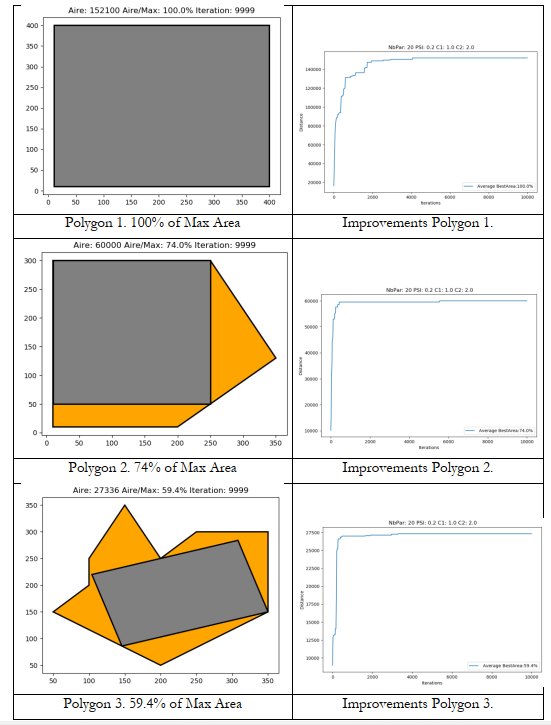

# A7--Optimization-of-Surface-Area-in-land-for-construction

## Introduction: 
> Given a land, how to build a building such that the maximum surface area of the land(non-convex polygon) is used with minimal wastage? Since the structure of the land is not same, the optimization algorithms are leveraged to find the maxium surface area.

## Objective
* Explote different optimization algorithm and compare their effectiveness towards finding the maximum usable area in given land
* Heuristic's approach used
            1.Simulated Annealing 
            2.Particle Swarm Optimization

## Problem formation 

* A Heuristics problem to build an approximation algorithm for finding the largest rectangle inside a non-convex polygon.
* The components of the problem are:

     - The polygon: the constrained search space;
     - The rectangle: the solution of the problem
     - Feasibility (is the rectangle inscribed in the polygon?): A constrained problem;
     - The area of the rectangle: the evaluation function;
     - Problem of maximization
        * In this case we maximize the Area
        * To maximize Area we optimize two points or 4 coordinates and an angle for rotation

* The performance of all heuristic algorithms influenced by the search space structure. Consequently, the design of an efficient algorithm needs to exploit, implicitly or explicitly, some features of the search space. For many heuristics, especially local searches, the complexity of the algorithm is very strongly influenced by the asperity of the local structures of local optima

[click here for full documentation of project](https://github.com/induraj2020/A7--Optimization-of-Surface-Area-in-land-for-construction/blob/master/2019.12.14%20Report%20-%20Surface%20Opt.pdf)

## sample of outputs:

